# OOP ENROLLMENT SYSTEM - FINAL PROJECT

---

Author : Lourhin Maristela Mendoza (IT2D)

Course : Integrative Programming (InteProg)

Programming Language Used : Java

---

## Project Overview
This project is a console-based enrollment system built in Java. It lets you manage 
students, instructors, courses, sections, and departments — and handles tuition fee 
calculations and payments.

### Features
* Full CRUD — add, view, update, and remove students, courses, and instructors
*  Tuition Management — calculate fees, process payments, and track balance status
* Duplicate Prevention — stops duplicate Student, Instructor, or Course IDs from being added
* Capacity Guard — blocks enrollment when a section is already full
* Institutional Hierarchy — see the full structure: Department → Section → Instructor → Students

### What It Can Do
* Students — add, view, update, remove 
* Courses — add, view, update, remove
* Instructors — add, view, update, remove, assign to a section
* Sections — add, view, update, delete, assign a course 
* Departments — add, view, link sections and instructors 
* Enrollment — enroll students into sections, view full institutional hierarchy
* Tuition — calculate fees, make payments, check balance and payment status

### Validations 
* Enrolling into a full section is blocked and shows an error message 
* Adding a duplicate ID (student, course, or instructor) is blocked 
* Typing letters instead of numbers (units, capacity, payment) won't crash the program — it defaults to a safe value instead

## ENCAPSULATION

* Keeping data private and only allowing access through getters and setters.
* This shows that the data inside Student is protected — nobody can directly change it from
outside the class. They have to go through the getter/setter methods.

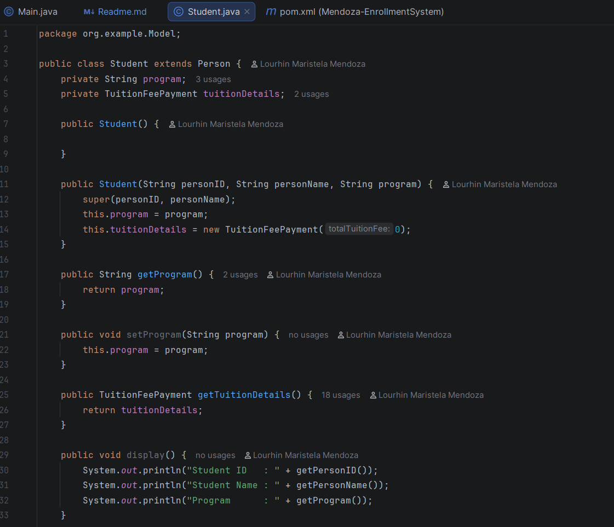

---

## INHERITANCE
* Child classes reuse the fields and methods of a parent class.

Person Class
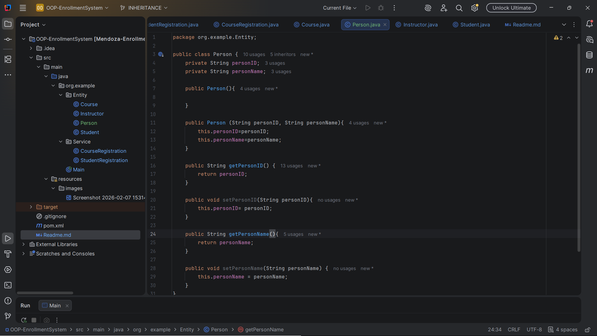

Student Class
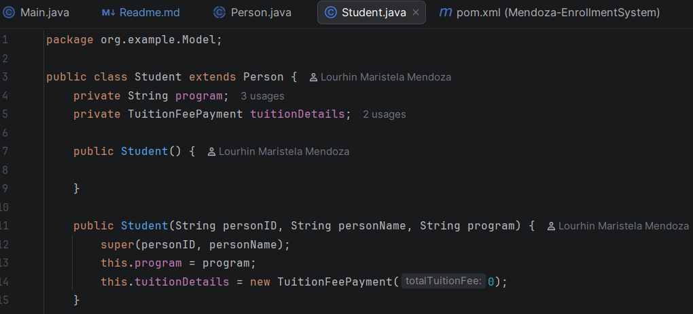
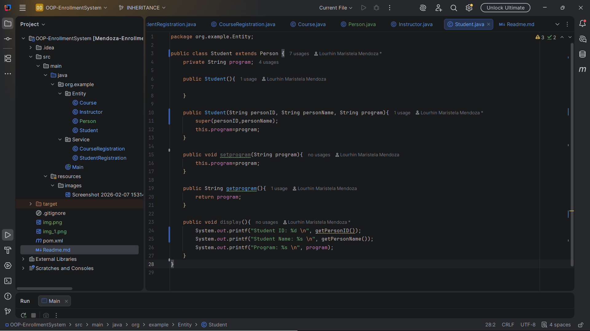

Instructor Class
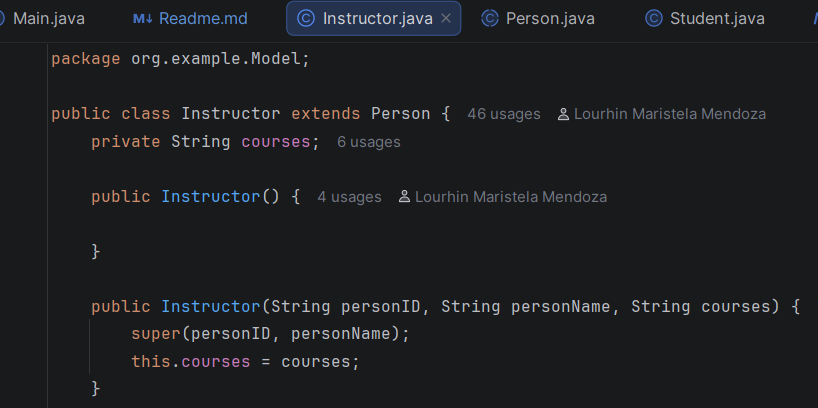

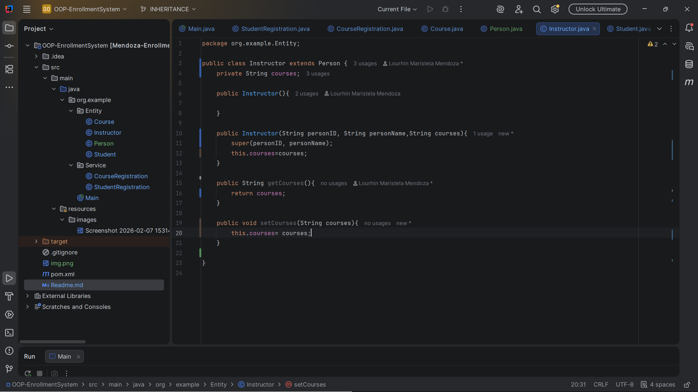

* This shows that both Student and Instructor inherit personID and 
personName from Person without rewriting them.

## ABSTRACTION
* Hiding the details and only showing what's necessary.

Person
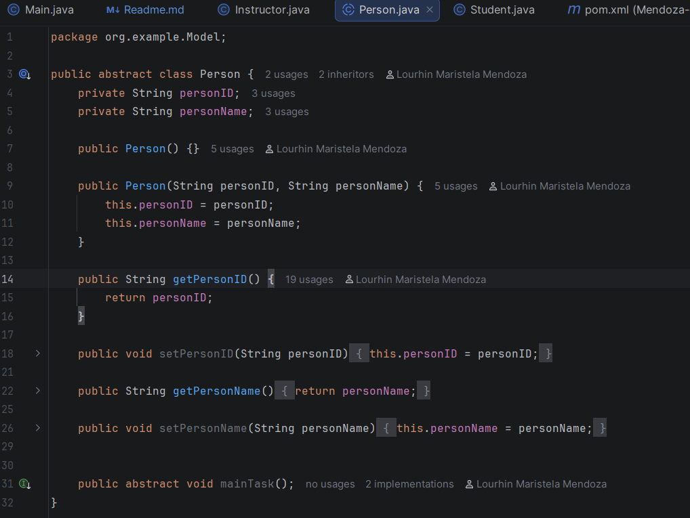

Instructor
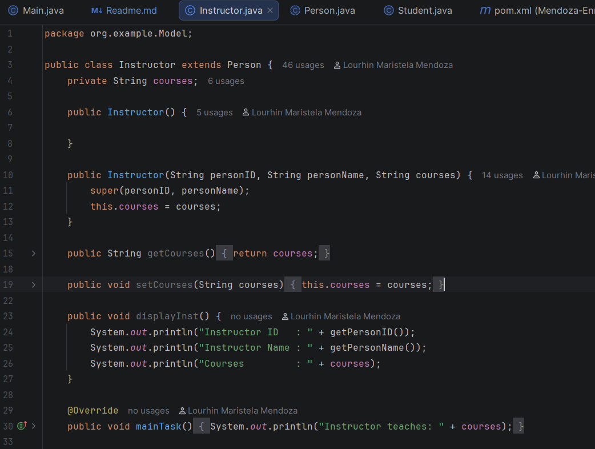

Student
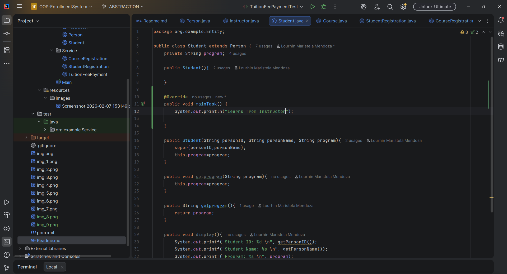

* This shows that Person forces every subclass to define their own version of mainTask()
— the parent doesn't know the details, only that it must exist.

## INTERFACE

* A contract that says "any class that implements me must have these methods."

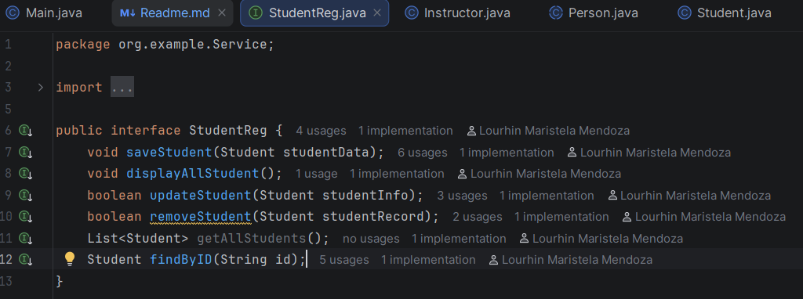
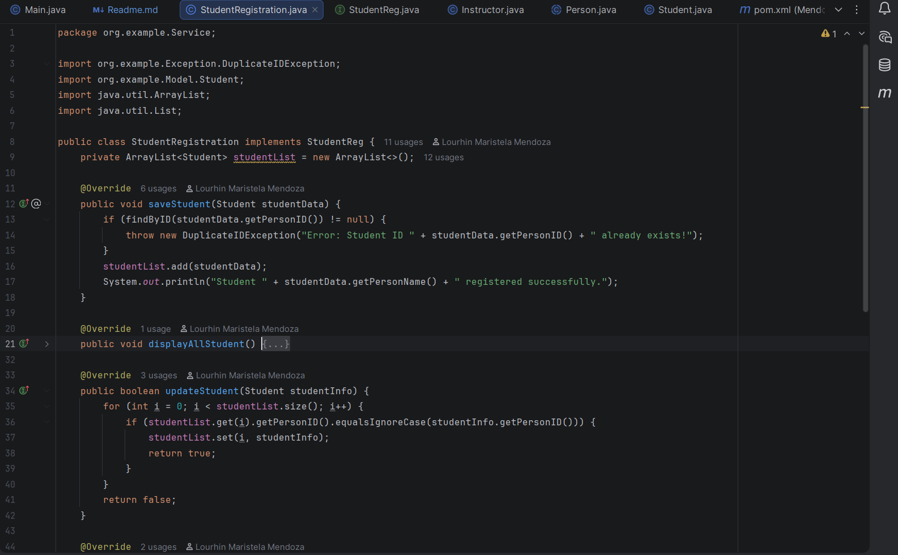

* This shows the separation between what the service should do 
(interface) and how it does it (implementation).

## POLYMORPHISM

* One variable type, many possible behaviors 
depending on the actual object.

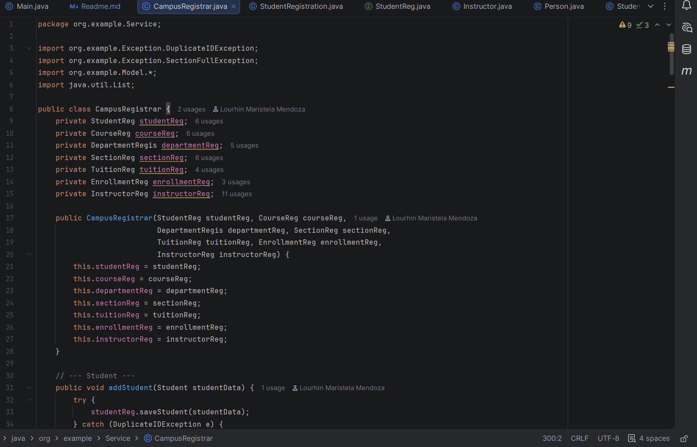

* This shows that CampusRegistrar only knows about the interfaces —
it doesn't care which concrete class is behind them.

## BONUS FEATURES
*  JUnit 5 — Automated Unit Testing 
Proves the business logic works without manually running the program every time.
*  DuplicateIDException — A custom exception that gets thrown whenever someone tries to add
an ID that already exists.
*  SectionFullException — A custom exception that gets thrown when a student tries to enroll in
a section that's already at max capacity.
* Advanced Input Validation — Prevents the program from crashing when a user types letters where 
numbers are expected.

**UNIT TESTS**

Tests are inside src/test/java/org/example/Service/
* StudentRegistrationTest - save, remove, duplicate ID update
* CourseRegistrationTest - save, update, duplicate ID remove
* InstructorRegistrationTest - save, assign to section, duplicate ID, delete
* EnrollmentServiceTest - enroll success, section full, capacity limit
* TuitionFeePaymentTest - fee calculation, discount, payment
* TuitionRegistrationTest - overpayment, remaining balance, full payment

