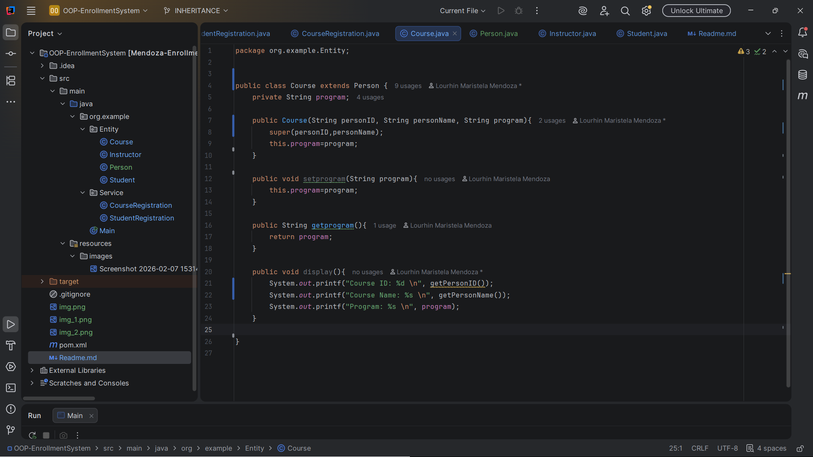
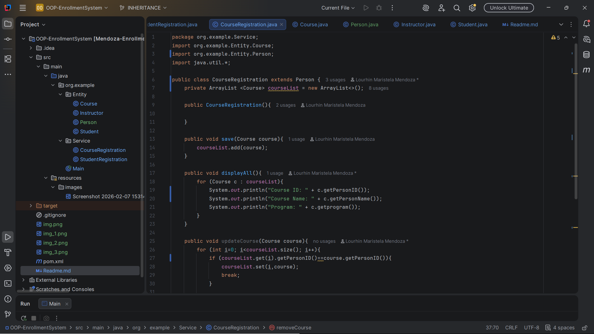
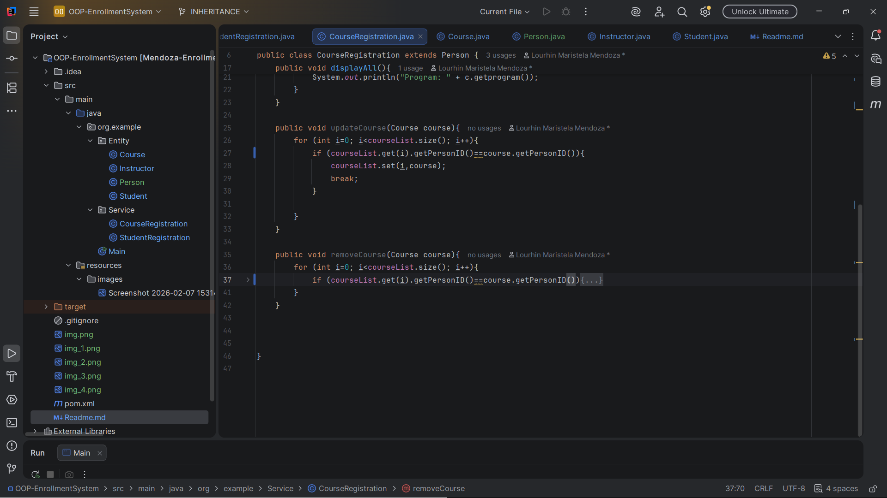
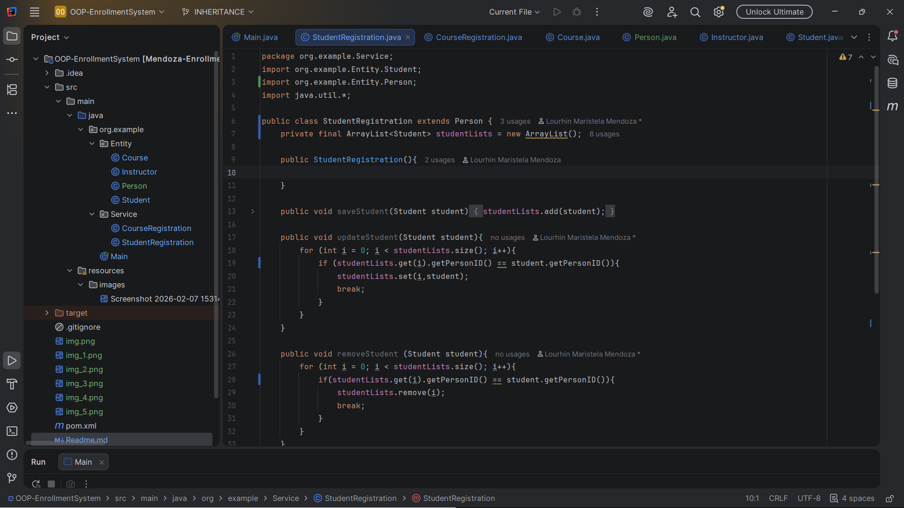
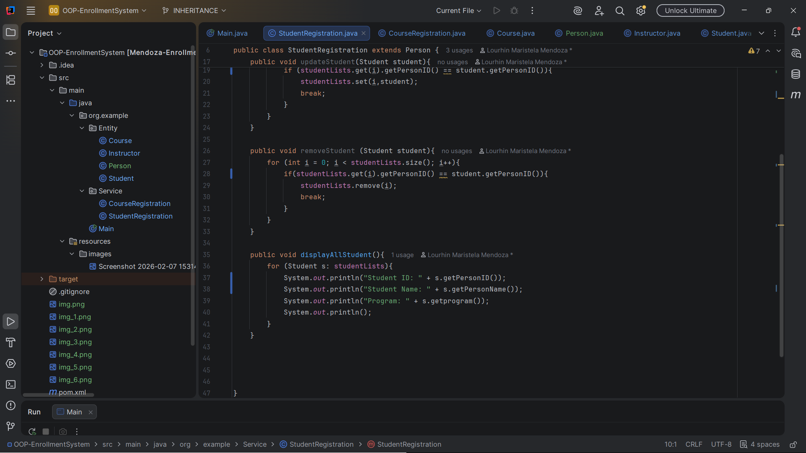
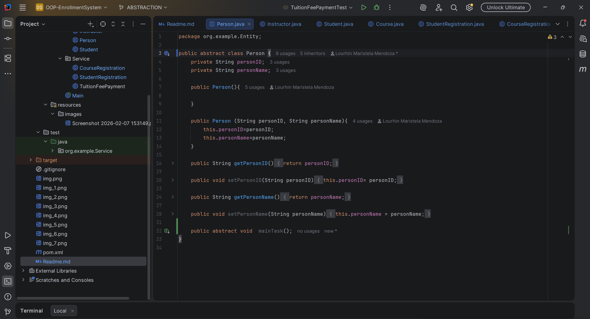
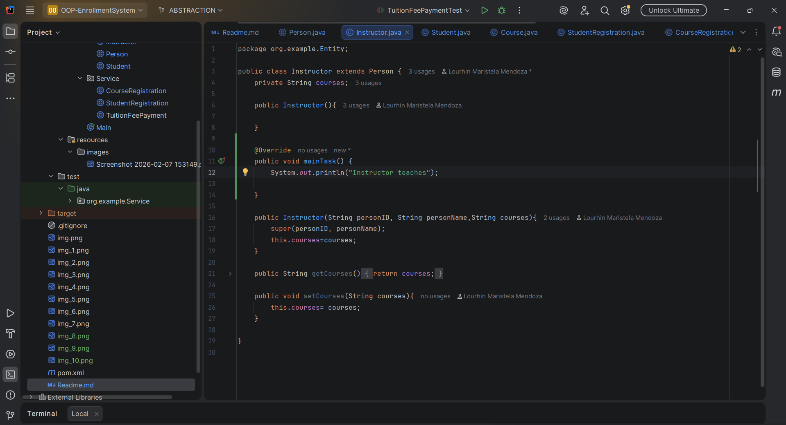

# OOP ENROLLMENT SYSTEM

---

Author : Lourhin Mendoza

**ENCAPSULATION**

---

# INHERITANCE

Instructor Class

Student Class

Course Class

CourseRegistration Class

StudentRegistration Class

# ABSTRACTION

Person

Instructor

Student

